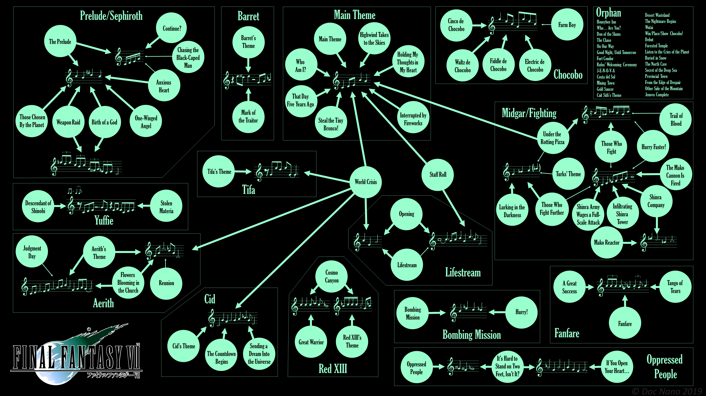

# Interactive FFVII Soundtrack Analysis

An [interactive version](https://mhamilt.github.io/doc-nano-ffvii-analysis/) of [Doc Nano's](https://www.youtube.com/watch?v=F0oKtlwm2p0) analysis [graph](https://www.dropbox.com/scl/fi/9qlo35pq73ut26ckk4hok/Doc-Nano-Final-Fantasy-VII-Soundtrack-Theme-Analysis-v2.png?rlkey=k7lrmoy44rp4hkqcxbhw69nnm&dl=0) of the Final Fantasy VII soundtrack

## Requirements

This has only been tested in the lates version of chrome.

## Font

Font used is Google's _Playfair Display_
